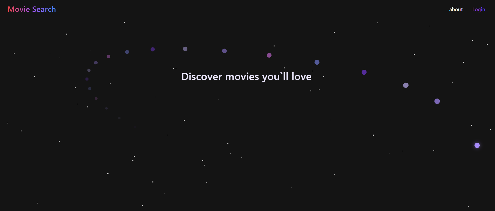
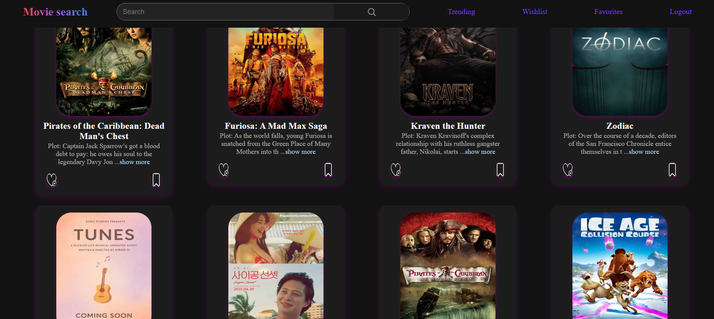
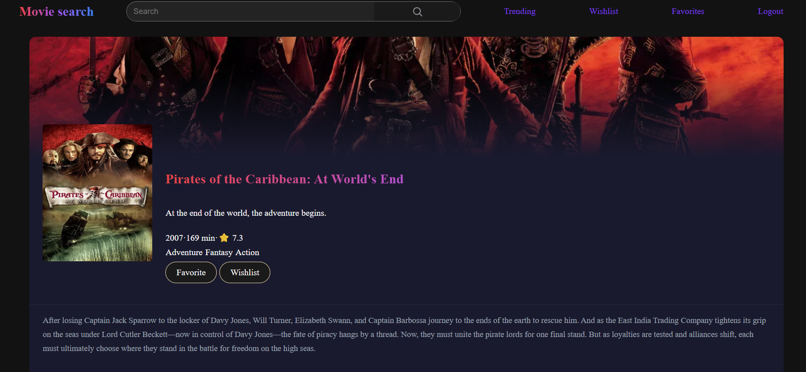
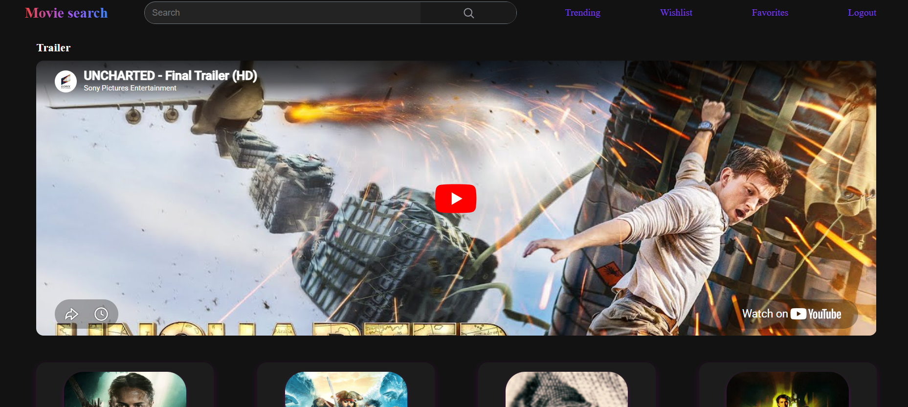
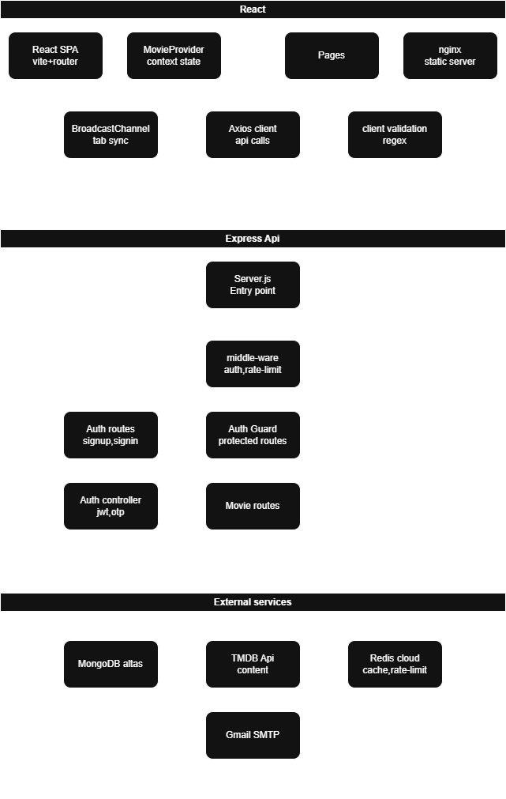

# Movie Search App

A full-stack movie discovery web application built with React, Express, MongoDB, and Redis. Search for movies, save favorites, build a watchlist, and watch trailers — all in one place.


**Best viewed on desktop** — not optimized for mobile

---

## Screenshots

### Landing page


### Movie discovery


### Movie details


### Trailer playback


---

## Architecture


---

## Features

**Authentication**
- Email and password signup with OTP verification via email
- JWT access and refresh token rotation with httpOnly cookies
- Forgot password and reset password via OTP
- Demo account for quick access
- Brute force protection with per-email rate limiting
- Logout synced across all open tabs via BroadcastChannel API

**Movies**
- Infinite scroll with random popular movies on each load
- Trending movies section
- Debounced search with real-time results
- Movie details page with backdrop, genres, runtime, and rating
- YouTube trailer embed on details page
- Movie recommendations on details page

**User library**
- Add or remove movies from Wishlist and Favorites
- Persistent across sessions

**Performance**
- Redis caching for TMDB API responses (15 min TTL)
- Per-email rate limiting backed by Redis
- Loading skeletons
- Toast notifications for user feedback

---

## Tech stack

| Layer | Technology |
|---|---|
| Frontend | React 18, Vite, React Router, Axios |
| Backend | Node.js, Express.js |
| Database | MongoDB Atlas, Mongoose |
| Cache | Redis Cloud |
| Auth | JWT, bcrypt, nodemailer (OTP) |
| Proxy | nginx (reverse proxy + static serve) |
| Containerization | Docker, Docker Compose |
| External API | TMDB API |

---

## Project structure

```
movie-search-app/
├── React/                  # Frontend
│   ├── src/
│   │   ├── Pages/          # Route-level components
│   │   ├── components/     # Shared UI components
│   │   └── utils/          # Axios config, validation, debounce
│   ├── nginx.conf
│   └── Dockerfile
├── express/                # Backend
│   ├── routes/             # Auth and movie routes
│   ├── controllers/        # Auth business logic,JWT auth
│   ├── middleware/         # rate limiter,Auth Guard
│   ├── models/             # Mongoose schemas
│   ├── utils/              # JWT, mailer, OTP hashing
│   └── Dockerfile
└── compose.yaml
```

---

## Local setup

### Prerequisites
- Node.js 20+
- MongoDB running locally or Atlas URI
- Redis instance
- TMDB API key
- SMTP PASS

### Environment variables

**`express/.env`**
```env
PORT=3000
MONGO_URI=mongodb://localhost:27017/moviedatabase
JWT_ACCESS_SECRET=your_access_secret
JWT_REFRESH_SECRET=your_refresh_secret
TMDB_API_KEY=your_tmdb_key
EMAIL_ADMIN=your_gmail
EMAIL_APP_PASS=your_app_password
REDIS_HOST=your_redis_host
REDIS_PORT=your_redis_port
REDIS_PASSWORD=your_redis_password
NODE_ENV=development
```

**`React/.env`**
```env
VITE_BACKEND=http://localhost:3000
VITE_IMAGE_BASE_URL=https://image.tmdb.org/t/p/w500
VITE_BACKDROP_BASE_URL=https://image.tmdb.org/t/p/w1280
```

### Run locally

```bash
# Backend
cd express
npm install
node Server.js

# Frontend
cd React
npm install
npm run dev
```

### Run with Docker

```bash
docker compose up --build
```

Frontend available at `http://localhost:5173`

---

## API overview

| Method | Route | Description | Auth |
|---|---|---|---|
| POST | `/api/signup` | Register with email | No |
| POST | `/api/signin` | Login | No |
| POST | `/api/logout` | Logout + clear cookies | Yes |
| POST | `/api/verifyotp` | Verify signup OTP | No |
| POST | `/api/forgotpassword` | Send reset OTP | No |
| POST | `/api/resetpassword` | Reset password | No |
| GET | `/api/popularmovies` | Random popular movies | Yes |
| GET | `/api/trending` | Trending movies | Yes |
| POST | `/api/search` | Search movies | Yes |
| GET | `/api/movie/:id` | Movie details | Yes |
| GET | `/api/movie/:id/videos` | Movie trailer | Yes |
| GET | `/api/movie/:id/recommendations` | Similar movies | Yes |
| POST | `/api/wishlist` | Toggle wishlist | Yes |
| POST | `/api/favorites` | Toggle favorites | Yes |
| GET | `/api/wishlist` | Get wishlist | Yes |
| GET | `/api/favorites` | Get favorites | Yes |
| GET | `/api/health` | Health check | No |

---

## Data attribution

Movie data provided by [TMDB](https://www.themoviedb.org). This product uses the TMDB API but is not endorsed or certified by TMDB.

---

## License

MIT
