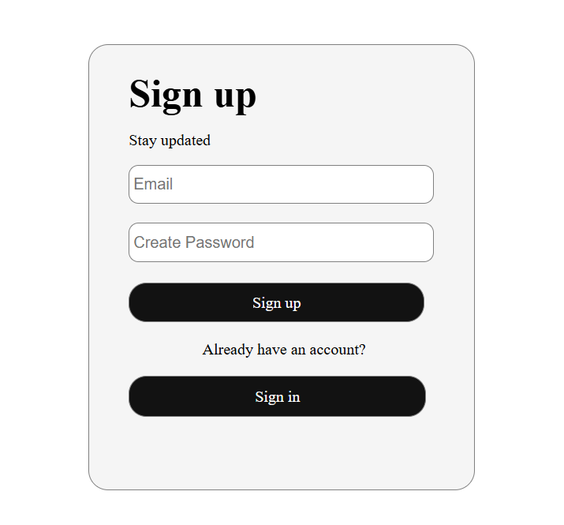
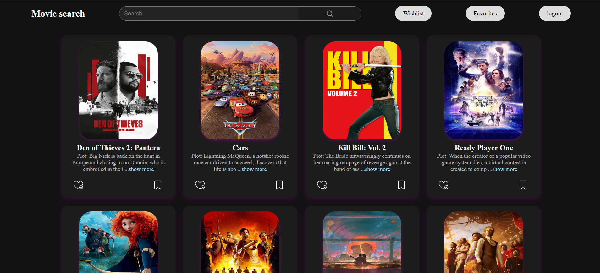
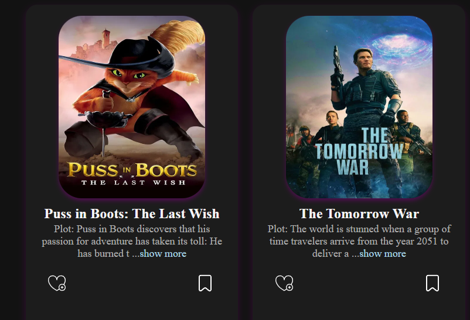

API used-https://api.themoviedb.org
 
# Movie Search App

## Overview
The Movie Search App is a full-stack web application that allows users to search for movies, view movie details, and manage user authentication.  
The frontend is built using React, while the backend is powered by Node.js and Express, with MongoDB used for storing user data.

The application integrates the TMDB API to fetch movie information in real time.

---

## Features

### Authentication
- User signup and signin
- Password reset functionality

### Movie Search
- Search for movies using an external API
- View search results instantly

### Movie Details
- View detailed movie information such as description and metadata

### Responsive UI
- Designed to work on both mobile and desktop devices

---

## Tech Stack

### Frontend
- React.js
- CSS
- Axios (API requests)

### Backend
- Node.js
- Express.js
- MongoDB
- Mongoose

---

## Project Structure

   # Frontend-react
 - src/
 - assets/
 - components/     - UI components  
 - Pages/          - routes  
 - main.js         - Main App component  
 - App.js          - Entry point  
 - public/         - Static assets  
 - package.json    - Dependencies & scripts 

 # Backend-node
 - server.js       - Entry point  
 - mongoosedb.js   - Database connection  
 - package.json    - Dependencies & scripts  

---

## Installation & Setup

### Prerequisites
- Node.js installed
- MongoDB running locally or via cloud service

### Backend Setup
- navigate to the express folder
- npm install
- npm start

### Backend Setup
- navigate to react folder
- npm install
- npm run dev

---

## API Usage

This project uses **The Movie Database (TMDB) API**.

Add your API key in the Backend `.env` file:

API_KEY=your_api_key_here

---

## Contributing

Feel free to fork this repository and submit pull requests. Contributions are welcome.
