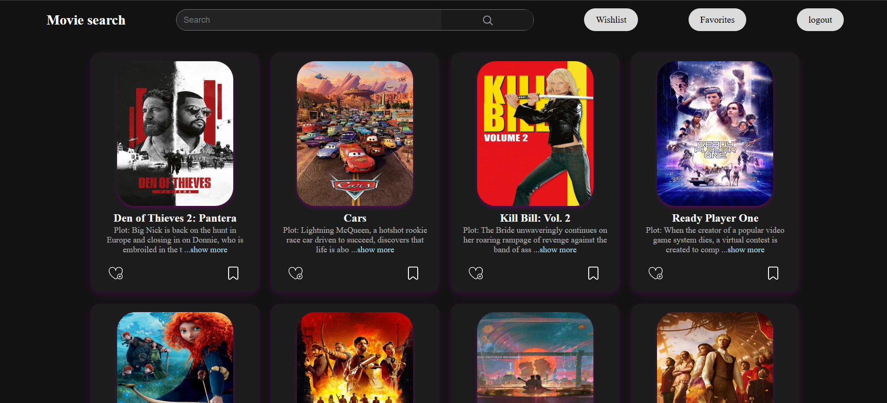

API used-https://api.themoviedb.org
 
 Movie Search App

Overview--The Movie Search App is a full-stack web application that allows users to search for movies, view details, and manage authentication. The frontend is built using React, and the backend is powered by Node.js with MongoDB for data storage.

Features--
<h3>authentication</h3>-
signup,signin,reset password 
 

<h3>Movie Search</h3>-
 Search for movies using an API 
 

<h3>Movie Details</h3>-
  View movie descriptions, and other details.  
 

<h3>Responsive UI</h3>-
 Optimized for both mobile and desktop devices.
 

Tech Stack---

Frontend-
-React.js
-CSS
-Axios (for API requests)

Backend-
-Node.js
-Express.js
-MongoDB & Mongoose

Project Structure-->

-- Frontend-react/
│   ├── src/
│   │   ├── assets/
│   │   ├── components/     # UI components  
│   │   ├── Pages/          # routes  
│   │   ├── main.js         # Main App component  
│   │   ├── App.js          # Entry point  
│   ├── public/             # Static assets  
│   ├── package.json        # Dependencies & scripts 

|-- Backend-node/
│   ├── server.js         # Entry point  
│   ├── mongoosedb.js     # Database connection  
│   ├── package.json      # Dependencies & scripts  

Installation & Setup

Prerequisites-
-Node.js installed
-MongoDB running locally or on a cloud service

backend setup
1.navigate to the express folder
2.npm install
3.npm start

frontend setup
1.navigate to react folder
2.npm install
3.npm run dev

API usage 
-Ensure you set the API key in the frontend .env file: API_KEY=your_api_key_here

Contributing

Feel free to fork this repository and submit pull requests. Contributions are welcome!
